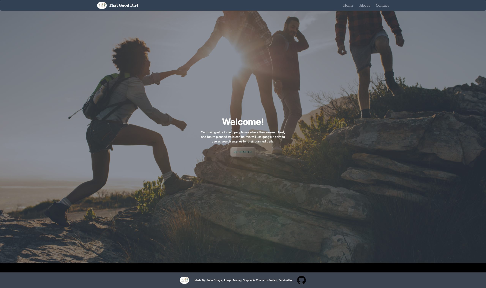

# ThatGoodDirt
# Project 1

With simple and easy instructions we made it possible for anyone to enjoy mother nature.

Creating a safe and interacive platform for users to now find and experience trails near them.

Making it a walk in the park from start to finish.  

<!-- /*internet media type */ -->
## Made with HTML/CSS/JS/Tailwind

## Project location
  * REPO LINK 
  https://github.com/JosephLMurray/ThatGoodDirt

* LIVE LINK
https://josephlmurray.github.io/ThatGoodDirt/

Initial relaease April 15, 2022

## Developed by 

* Joseph Murray
https://github.com/JosephLMurray

* Sarah Attar
https://github.com/SarahAmel

* Rene Ortega
https://github.com/schaparro08

 * Stephanie Charparro-Roldan 
 https://github.com/schaparro08

* Type of format Markdown 

## Image of project 

# Expected behavior 

*Once the user selects get started then the user will be promted with a questionire allowing ThatGoodDirt to acomadate the user to there prefered trail prefrence. 

* The user should be able to put in their loction information. 

* The user should be able to select the type of trail they would enjoy.

* The user should be able to choose the distance of the trail desired.

* The user should be then propmtly redirected to be given trail options based on the selected users imputed criteria.  

* Once the user desides on which route to embark on the application will redirect the user to the first step of their GoodDirt journey exterience. 

